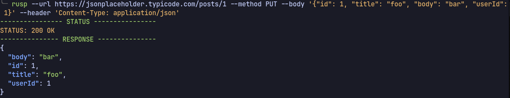

<p align="center">
  
</p>

## Why it's name is RUSP?

It's a play on "Rust" and "curl" that could stand for "Rust Simple Protocol".

I made this http client app just for fun and to improve my [RUST](https://www.rust-lang.org/learn) skills,
I tried to make reverse engineering to CURL application but my application is extremely simple.

## Features:

- [x] Arguments.
- [x] http requests.
  - [x] GET
  - [x] POST
  - [x] PUI
  - [x] PATCH
  - [x] DELETE
- [x] Pretty print response.
- [ ] Testing.

## Installation:

If for some reason you want to use this script follow the next steps.

> DISCLAIMER!!!
>
> - This set up is for linux users.
> - You need to have installed `cargo` on your machine.

1. Clone this repository:

```sh
git clone https://github.com/freddyvelarde/rusp
```

2. Move this project to .config file:

```sh
mv rusp ~/.config
# then
cd ~/.config/rusp
```

3. Just run this command in the `rusp`project directory:

```
cargo build
# or
cargo run
```

4. Copy and paste this line in your .zshrc if you're zsh user or .bashrc if you're bash user:

```bash
alias rusp="~/.config/rusp/target/debug/rusp --"
```

5. Finally run this command depending if you're bash or zsh user (or even another unix shell like fish)

```bash
# zsh users
source ~/.zshrc

# bash users
source ~/.bashrc
```

## Usage:

To make `get` requests, use the 'method GET' flag '-m GET'

```bash
rusp --url https://jsonplaceholder.typicode.com/users --method GET
```


To make `post`: 'method POST' or '-m POST'

```bash
rusp --url https://jsonplaceholder.typicode.com/posts --method POST --body '{"title": "title post", "content": "content post"}' -- 'Content-Type: application/json'
```


To make `put`: 'method PUT' or '-m PUT'

```bash
rusp --url https://jsonplaceholder.typicode.com/posts/1 --method PUT --body '{"id": 1, "title": "foo", "body": "bar", "userId": 1}' --header 'Content-Type: application/json'
```



To make `patch`: 'method PATCH' or '-m PATCH'

```bash
rusp --url https://jsonplaceholder.typicode.com/posts/1 -method PATCH -b '{"title": "foo"}' --header 'Content-Type: application/json'
```


To make `delete`: 'method DELETE' or '-m DELETE'

```bash
rusp --url https://jsonplaceholder.typicode.com/posts/1 --method DELETE
```

## Missing and future features:

- Still can't upload files like images or pdfs.
- Some Http methods like HEAD or OPTIONS were not implemented.
- Auto Installer.
